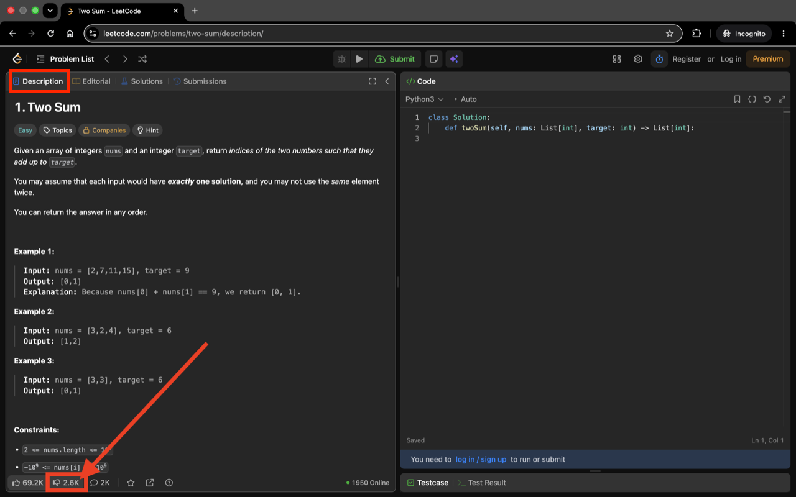
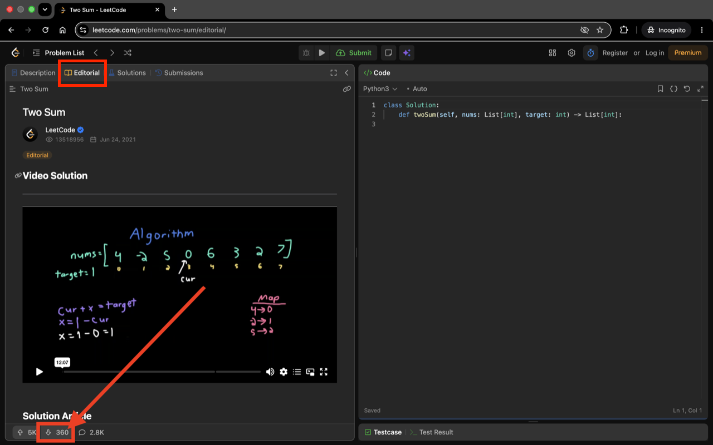
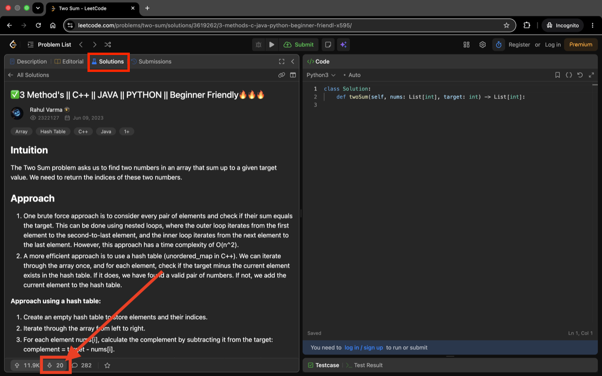

# Dislike Count For LeetCode

A browser extension for Chrome, Firefox, and Edge that restores the hidden dislike count on LeetCode.

*This extension is not affiliated with, endorsed by, or connected to LeetCode.*


## How it works

The extension fetches dislike counts from LeetCode's own public GraphQL API using the problem slug from the URL, and injects the count into the dislike button.
Supported pages: problem, editorial, solution, discuss post

Comments (and their replies) on those pages can get dislike counts too: a small script in the page's
world reads each comment's identity from the rendered page and tags its vote row, then the
extension refetches the same comment query from the GraphQL API — which still returns both the
upvote count and the net score — and shows the difference next to the downvote arrow.

The solutions list can also show each solution's dislike count next to its upvote count: the
extension reads each card's topic id from its link and fetches the reaction counts for all
visible cards in a single batched GraphQL request.

Because these features rely on LeetCode page internals, they are **off by default**: enable
"Show dislike counts on comments" and/or "Show dislike counts in the solutions list" in the
extension's toolbar popup. While the comment feature is disabled, the page-world script
stays completely dormant — it only ever acts when the extension asks it to, which never happens
with the feature off. Toggling takes effect immediately, even on already-open LeetCode pages.

## Install

### Chrome Web Store

https://chromewebstore.google.com/detail/dislike-count-for-leetcod/gjbiemmdpdncpbjmgemebpddnikiiomn

### Firefox Add-ons

https://addons.mozilla.org/en-US/firefox/addon/dislike-count-for-leetcode/

### Edge Add-ons

https://microsoftedge.microsoft.com/addons/detail/dislike-count-for-leetcod/fofjkcfafaiimgdfpfjbkeifenlmaefn

### Repo

1. Clone or download this repository:
   ```sh
   git clone https://github.com/nex-54/Dislike-Count-For-LeetCode.git
   ```
2. Open `chrome://extensions` in Chrome (or `edge://extensions` in Edge).
3. Enable **Developer mode** (toggle in the top-right corner).
4. Click **Load unpacked** and select the repository folder.

In Firefox, open `about:debugging#/runtime/this-firefox`, click **Load Temporary Add-on**, and
select the repository's `manifest.json` (temporary add-ons are removed when Firefox restarts).

## Development

After editing scripts, reload the extension on `chrome://extensions` (click the reload icon), then refresh the LeetCode page to see the change.

### Releasing

The `version` field in `manifest.json` is the single source of truth. Bumping it drives
everything else.

1. Update the `version` field in `manifest.json` and push the change to `main`.
2. The `release` workflow runs the smoke test, then — only if it passes — reads the new
   version, builds `dislike-count-for-leetcode-<version>.zip` via `./build.sh`, and creates
   the `v<version>` tag and a GitHub release with that zip attached.
3. Download the zip from the release and upload it to the Chrome Web Store, Firefox Add-ons
   (AMO), and Edge Add-ons.

The workflow only runs when the version in `manifest.json` changes and skips versions that already have a
tag.

### Local builds

```sh
./build.sh
```

### Tests

Playwright tests load the extension against live leetcode.com pages: a smoke test that each page type
(problem, editorial, solution, discuss post) shows a dislike count on its own, an integration test that navigates
between them by clicking the Editorial/Solutions tabs and a solution post, verifying the count updates
correctly across in-app (SPA) navigation without a page reload, and comments and solutions tests that
enable the respective opt-in counts through the popup and check that editorial comments and solutions
list cards show them. CI (and the release gate) runs only the smoke test; the other tests run locally
via `./test.sh`.

```sh
./test.sh
```

## Screenshots

### Description



### Editorial



### Solutions


