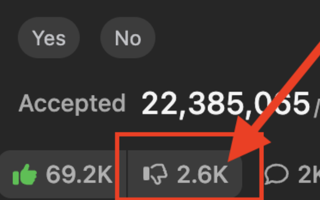

# Dislike Count For LeetCode

A Chrome extension that restores the hidden dislike count on LeetCode.

*This extension is not affiliated with, endorsed by, or connected to LeetCode.*



## How it works

The extension fetches dislike counts from LeetCode's own public GraphQL API using the problem slug from the URL, and injects the count into the dislike button.
Supported pages: problem, editorial, solution

## Install from the repo

1. Clone or download this repository:
   ```sh
   git clone https://github.com/nex-54/Dislike-Count-For-LeetCode.git
   ```
2. Open `chrome://extensions` in Chrome (or any Chromium-based browser).
3. Enable **Developer mode** (toggle in the top-right corner).
4. Click **Load unpacked** and select the repository folder.

## Development

After editing `content.js`, reload the extension on `chrome://extensions` (click the reload icon), then refresh the LeetCode page to see the change.

### Releasing

1. Update the `version` field in `manifest.json` and commit.
2. Tag the release so the published package can be traced back to the exact source:
   ```sh
   git tag -a v<version> -m "Release <version>"
   git push origin v<version>
   ```
3. Run `./build.sh` and upload `dislike-count-for-leetcode-<version>.zip` to the Chrome Web Store.

## Screenshots

### Problem page


### Editorial page


### Solution post

